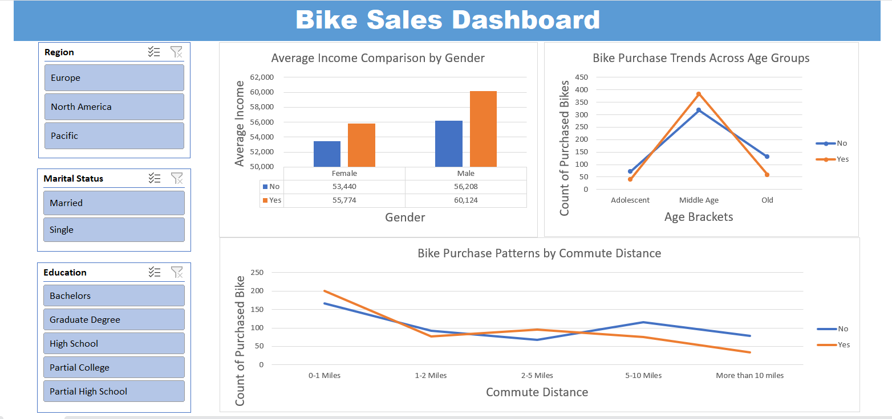

# Bike Purchase Insights Dashboard

## Introduction

This dashboard provides a visual exploration of customer demographics, lifestyle factors, and purchasing behavior related to bike ownership. The goal of the analysis is to identify patterns and potential factors influencing bike purchase decisions across various population segments. By transforming raw survey data into meaningful visuals, the dashboard enables users to quickly identify behavioral trends and relationships among customer attributes.

---

## Dashboard File

The dashboard is provided as a single Excel file that consolidates the underlying dataset and visualizations into an interactive reporting view. Users can explore insights dynamically using built-in filters, making the dashboard suitable for presentations, exploration, and reporting.

My final dashboard is in [Bike-Sales-Dashboard.xlsx](./Bike-Sales-Dashboard.xlsx).

---

## Excel Skills Used

This dashboard was developed leveraging key analytical and visualization features in Excel, including:

- Pivot Tables for dynamic summarization and grouping
- Pivot Charts for data driven storytelling
- Slicers to enable interactive filtering
- Formulas and functions for cleaning, transforming, and preparing the data

These elements work cohesively to ensure the dashboard remains flexible, interactive, and easy to update with new data sources.

---

## 📊 Dashboard Build & Insight Overview

The visualizations translate numerical and categorical data into meaningful insights. Each visual has been crafted to help users understand the relationships and behavioral patterns among different groups.

Key themes represented in the dashboard include:

- **Income Trends:** The comparison between demographic groups highlights the correlation between income levels and purchasing behavior. By visualizing income differences across categories, the dashboard reveals how financial capacity may influence consumer decisions.

- **Age-Based Behavior:** Trends across age segments help identify which groups show higher or lower interest in purchasing a bike. This temporal insight provides value for targeted marketing and product positioning.

- **Lifestyle Influence:** Commute distance and related lifestyle indicators provide context on how transportation habits affect the likelihood of purchasing a bike. These patterns enable viewers to connect day-to-day needs with purchasing motivation.

Filters allow stakeholders to focus on specific regions, education levels, or marital categories, enabling tailored insight based on business needs or audience interests.

---

## Conclusion

The Bike Purchase Insights Dashboard delivers a clear and interactive view of customer behavior, providing valuable clues into how demographic and lifestyle variables relate to bike purchasing decisions. The use of visualization and dynamic controls ensures that insights can be explored from multiple perspectives, making the dashboard a practical tool for decision-making, trend identification, and strategic planning.

---
