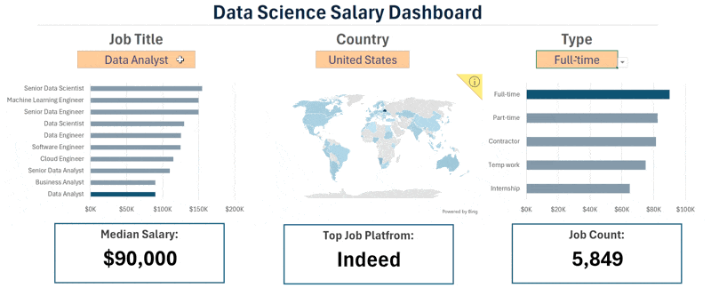

# Excel_Project-Data_Analytics

Welcome to my **Excel Data Analytics Portfolio** - a collection of projects that demonstrate how powerful Excel can be for data cleaning, analysis, and dashboard creation.

Each project is based on real-world datasets and focuses on exploring insights through data storytelling, visualization, and decision-driven analysis.

## 📘 Projects Overview

### 🔹Excel Salary Dashboard

**Goal:** Create an interactive dashboard to visualize salary trends across job roles and countries.

**Key Highlights:**

- Built dynamic charts and maps to explore salary by job title and country
- Used formulas, data validation, and array functions for interactivity
- Designed a clean, user-friendly dashboard for quick insights
- **Excel Skills Used:**
  - **Charts**
  - **Formulas**
  - **Data Validation**
  - **Dashboard Design**

📄 [Read More →](./Salary_Dashboard/README.md)

---

### 🔹Data Analysis : Exploring the Data Science Job Market

**Goal:** Analyze job titles, skills, and salaries to identify patterns in the data science job market.

**Key Highlights:**

- Explored the relationship between skills and salary levels
- Compared regional pay gaps across job roles
- Identified top skills (Python, SQL, Cloud tools) driving higher pay
- **Excel Skills Used:**
  - **Power Query**
  - **Power Pivot**
  - **DAX**
  - **Pivot Charts**

📄[Read More →](./Data_Analysis/README.md)

---

## 🧰 Tools & Techniques

| Category      | Excel Features Used                    |
| ------------- | -------------------------------------- |
| Data Cleaning | Power Query                            |
| Data Modeling | Power Pivot                            |
| Calculations  | DAX, Formulas, Functions               |
| Visualization | Pivot Charts, Map Charts, Combo Charts |
| Interactivity | Data Validation, Filters, Slicers      |

---

## 🧠 Learning Goals

Through these projects, I aim to:

- Strengthen **Excel as a data analytics tool**
- Develop **data driven storytelling** through dashboards
- Showcase **real world analytics workflows** for career growth

---

## 📸 Visual Preview

| Project              | Preview                                                       |
| -------------------- | ------------------------------------------------------------- |
| **Salary Dashboard** |  |
| **Data Analysis**    |       |

---

## Conclusion

This repository demonstrates how Excel can be used for end-to-end analytics from raw data transformation to professional dashboards and insights.

Each project focuses on solving practical business questions and applying advanced Excel features to uncover trends that drive better decisions.
